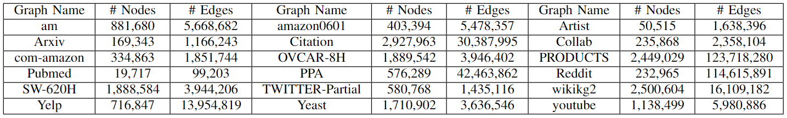
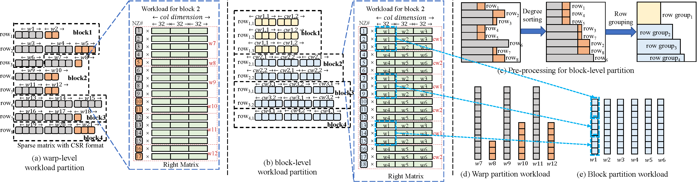
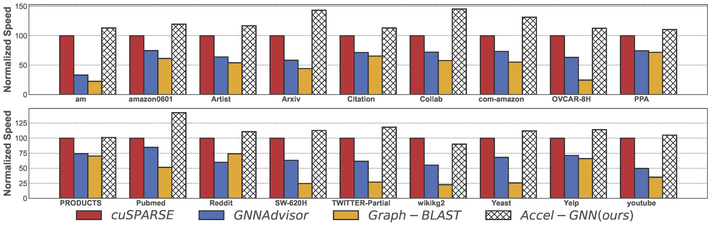

# ICCAD-Accel-GNN

Official Implementation of "Accel-GNN: High-Performance GPU Accelerator Design for Graph Neural Networks"

Please cite our paper if you use the code ✔
```
@inproceedings{xi2023AccelGCN,
  title={Accel-GCN: High-Performance GPU Accelerator Design for Graph Convolution Networks},
  author={Xie, Xi and Peng, Hongwu and others},
  booktitle={Proceedings of the 42st IEEE/ACM International Conference on Computer-Aided Design},
  year={2023}
}
```


## Abstract
This code contains a lightweight framework for benchmarking SPMM kernel designs.

The following SPMM kernels are benchmarked here:

`spmm_accel.cu`  The implementation of our Accel-GCN's SPMM kernel design.

`spmm_gnna.cu`  The SPMM kernel of [GNNAdvisor](https://github.com/YukeWang96/GNNAdvisor_OSDI21).

`spmm_cusparse.cu`  The [cuSPARSE](https://docs.nvidia.com/cuda/cusparse/index.html) SPMM functionality.


## Get started

### Prerequisites
Nvidia GPU with compute capability greater than or equal to 8.6

CUDA toolkit 12.0

cmake version 3.5

For the python scripts, numpy and scipy are required


### Download dataset
Our benchmark dataset contains 18 graphs:


It can be downloaded from https://drive.google.com/file/d/1_sE65oveGpzRdCcExBmUaNG982lUB-Cx/view?usp=drive_link , 
or you can use the following command:
```
wget --load-cookies /tmp/cookies.txt "https://docs.google.com/uc?export=download&confirm=$(wget --quiet --save-cookies /tmp/cookies.txt --keep-session-cookies --no-check-certificate 'https://docs.google.com/uc?export=download&id=1_sE65oveGpzRdCcExBmUaNG982lUB-Cx' -O- | sed -rn 's/.*confirm=([0-9A-Za-z_]+).*/\1\n/p')&id=1_sE65oveGpzRdCcExBmUaNG982lUB-Cx" -O 18graphs.tar.gz && rm -rf /tmp/cookies.txt
```
Place the downloaded file in the project directory, then unzip it (and rename it).
```
tar xzvf 18graphs.tar.gz
mv 18graphs graphs
```
Generate block-level partitioning meta-data.
```
mkdir block_level_meta
python block_level_partition.py
```

### Compilation
```
mkdir build
cd build
cmake ..
make -j10
```
After compilation, an executable file named `spmm_test` is generated.

## Benchmarking
Benchmark SPMM kernels on a specified graph and a specified right-hand matrix column dimension:
```
./spmm_test artist 60
```
If no parameters are attached, 
it will execute a traversal-style benchmark for all graphs and all right-multiply matrix column dimensions 
(controlled by `dim_min`, `dim_max`, and `interval` in `main.cu`):
```
./spmm_test
```
You can use a pipe to save the results: 
```
./spmm_test > result.txt
```

## Kernel design of Accel-GCN

The SPMM kernel of Accel-GCN incorporates block-level partitioning and a combined warp strategy for traversing the right-hand matrix column dimension. 
This approach exploits multi-level memory efficiency, memory coalescing, and alignment, which further optimizes execution efficiency.



### Speedups over other SPMM kernels

On average, evaluation of Accel-GCN across 18 benchmark graphs demonstrates that Accel-GCN surpasses cuSPARSE, GNNAdvisor, and graph-BLAST by 17.3%, 86.3%, and 193.5% respectively.


