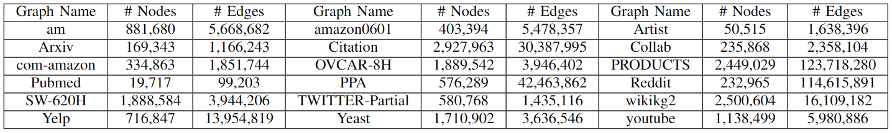
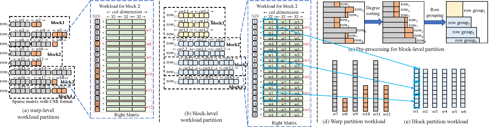
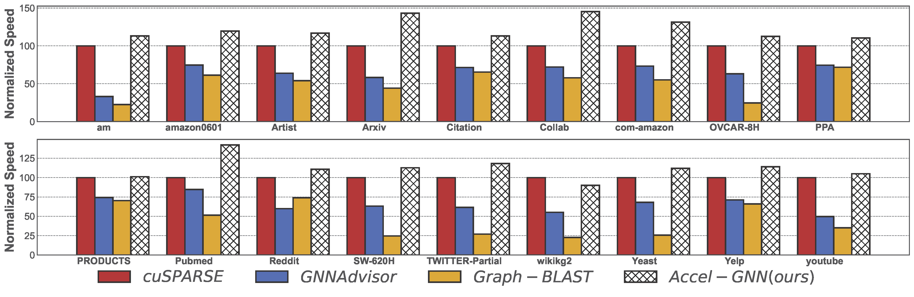

# ICCAD-Accel-GCN

Official Implementation of "Accel-GCN: High-Performance GPU Accelerator Design for Graph Neural Networks"

Please cite our paper if you use the code ✔
```
@inproceedings{xie2023AccelGCN,
  title={Accel-GCN: High-Performance GPU Accelerator Design for Graph Convolution Networks},
  author={Xie, Xi and Peng, Hongwu and Hasan, Amit and Huang, Shaoyi and Zhao, Jiahui and Fang, Haowen and Zhang, Wei and Geng, Tong and Khan, Omer and Ding, Caiwen},
  booktitle={Proceedings of the 42st IEEE/ACM International Conference on Computer-Aided Design},
  year={2023}
}
```


## CUDA preprocessing and mapped SpMM

The native benchmark generates Accel-GCN metadata directly with CUDA kernels,
then runs Accel-GCN and cuSPARSE on the original CSR. Only the row mapping,
virtual row offsets, and block metadata are generated: **edge indices and
weights are not reordered or copied**.

See [CUDA preprocessing and cache details](cuda_preprocess/README.md).

## Get started

Requires a CUDA toolkit with CUB and cuSPARSE, CMake 3.18 or newer, and a C++17
compiler. The default GPU target is compute capability 8.6; override
`CMAKE_CUDA_ARCHITECTURES` when configuring for another supported GPU.
Python is not required to build or run the benchmark.

### Download dataset
Our benchmark dataset contains 18 graphs:


It can be downloaded from https://drive.google.com/file/d/1_sE65oveGpzRdCcExBmUaNG982lUB-Cx/view?usp=drive_link , 
or you can use the following command:
```
wget --load-cookies /tmp/cookies.txt "https://docs.google.com/uc?export=download&confirm=$(wget --quiet --save-cookies /tmp/cookies.txt --keep-session-cookies --no-check-certificate 'https://docs.google.com/uc?export=download&id=1_sE65oveGpzRdCcExBmUaNG982lUB-Cx' -O- | sed -rn 's/.*confirm=([0-9A-Za-z_]+).*/\1\n/p')&id=1_sE65oveGpzRdCcExBmUaNG982lUB-Cx" -O 18graphs.tar.gz && rm -rf /tmp/cookies.txt
```
Place the downloaded file in the project directory, then unzip it (and rename it).
```
tar xzvf 18graphs.tar.gz
mv 18graphs graphs
```
### Build

```bash
cmake -S . -B build -DCMAKE_BUILD_TYPE=Release \
  -DCMAKE_CUDA_COMPILER=/usr/local/cuda-12.2/bin/nvcc
cmake --build build -j
```

### Run on GPU 2

From the repository root, regenerate metadata with CUDA on each invocation:

```bash
CUDA_VISIBLE_DEVICES=2 ./build/spmm_test collab 128 --graphs-dir graphs
```

Or generate once and reuse metadata from a cache directory:

```bash
CUDA_VISIBLE_DEVICES=2 ./build/spmm_test collab 128 --graphs-dir graphs \
  --metadata-cache metadata_cache
```

A cache miss or invalid entry triggers CUDA generation and replaces the entry.
Use `--metadata-generate` to explicitly select generation without caching.
Only `GRAPH.graph.ptrdump` and `GRAPH.graph.edgedump` are required; existing
`.new_indptr`, `.new_indices`, and `.block4` files are not used.

Run all graphs at 128 columns:

```bash
CUDA_VISIBLE_DEVICES=2 ./build/spmm_test --graphs-dir graphs --cols 128 \
  --metadata-cache metadata_cache
```

Without a feature width, the driver sweeps 16–128 columns. Metadata is prepared
once per graph and reused throughout the sweep. Output includes metadata setup
wall time and mean SpMM GPU times in milliseconds. Both kernels use 20 warmup
calls and 100 timed calls by default. Results are checked against cuSPARSE in
original node order; validation failure returns a nonzero exit status.
See `./build/spmm_test --help` for timing and validation options.

Cache integration tests are retained on
[`test/cuda-preprocessing`](https://github.com/xiexi51/ICCAD-Accel-GCN/tree/test/cuda-preprocessing).

## Kernel design of Accel-GCN

The SPMM kernel of Accel-GCN incorporates block-level partitioning and a combined warp strategy for traversing the right-hand matrix column dimension. 
This approach exploits multi-level memory efficiency, memory coalescing, and alignment, which further optimizes execution efficiency.



### Speedups over other SPMM kernels

On average, evaluation of Accel-GCN across 18 benchmark graphs demonstrates that Accel-GCN surpasses cuSPARSE, GNNAdvisor, and graph-BLAST by 17.3%, 86.3%, and 193.5% respectively.


